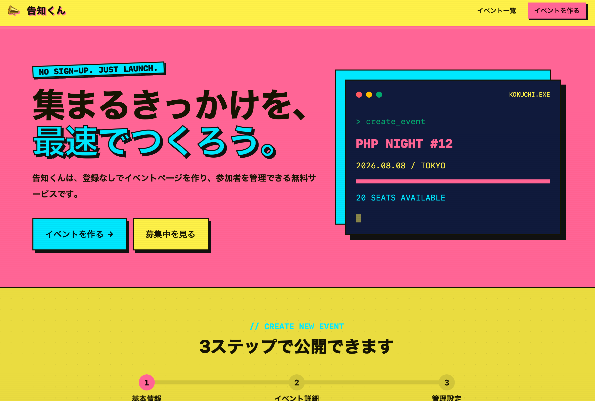

# 告知くん

PHPとSQLiteで動作する、登録不要のイベント告知・参加管理サービスです。

---

## 📷 スクリーンショット

---

## 🌐 デモ

[https://tsukuba42195.sakura.ne.jp/event_pr/](https://tsukuba42195.sakura.ne.jp/event_pr/)

---

## 💻 必要な環境

- PHP 8.1以上
- PDO SQLite拡張
- mbstring拡張
- Apache（`.htaccess`を利用する場合）

---

## 🕵 作者

向井聡（Akira Mukai）

- Blog: https://s0323861.github.io/
- GitHub: https://github.com/s0323861

---

## ☕️ サポート

If this project helped you, consider supporting its development.

Buy me a coffee:
https://ko-fi.com/akiramukai

---

## 🪪 ライセンス

MIT License
